## Навык "Купи слона"

### Шаг № 1
**С чего начать?**
* Делаем `fork` репозитория с библиотекой ["Алиса"](https://github.com/bmstu-iu8-2018-project/alice-skills-lib).
* Главная задача - реализовать собственную функцию, которая определят поведение Алисы в различных ситуациях. В нашем примере код функции
расположен в `source/main.cpp`. Мы назвали её `buy_elephant_callback`.

### Шаг № 2
**Что нужно для того, чтобы всё заработало на Travis?**
* После того как вы написали функцию и проверили её работоспособность локально, следует приступать к сборке на `Travis`.
* Для начала регистрируемся на `Docker Hub` и `Heroku`. Всё просто - создаем свой аккаунт, заполняя необходимые поля.
* [`Docker Hub`](https://hub.docker.com)
* [`Heroku`](https://dashboard.heroku.com)
* Теперь необходимо зарегистрировать новый `Heroku` контейнер. Ниже представлена инструкция, которая позволяет понять, как
это сделать. С помощью `Heroku` будет запущен ваш сервер.
1) На главной странице вашего аккаунта `Heroku` выбираем `Create new app`:
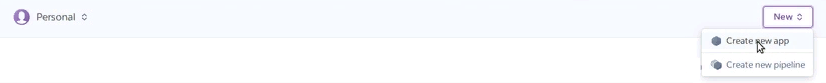
2) Зполняем необходимые поля:
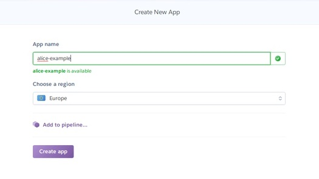
3) Результат будет представлять собой следующее:
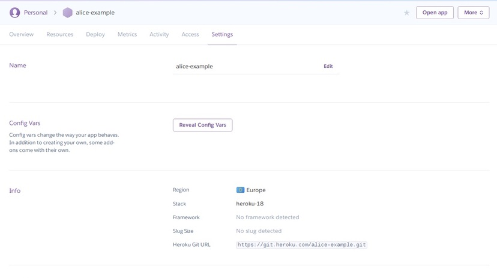
* `Docker` же позволяет "упаковать" ваше приложение со всем его окружением и зависимостями в контейнер.
* Сервису `Travis` необходимо предоставить определенные "ключи" и переменные, которые делают возможным доступ к вашим аккаунтам
на `Docker` и `Heroku`. Как их получить на сайте `Heroku` и как внести в `Travis`? Подробнее:
1) Получаем токен вашего аккаунта на `Heroku`:
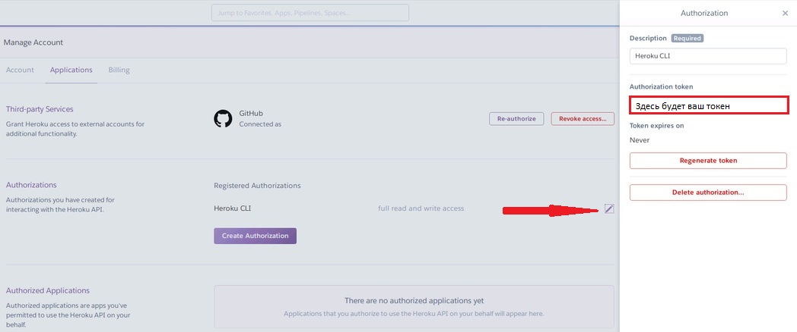
2) На `Travis`(`More options-> Settings`) добавляем `HEROKU_API_KEY` (это и есть полученный в предыдущем пункте токен) и
`HEROKU_APP_NAME` (имя контейнера, в нашем случае это `alice-example`).
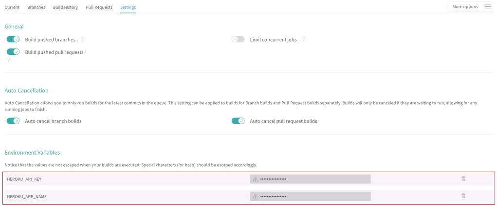
3) Добавляем еще три переменные среды (это необходимо для обеспечения доступа к вашему `Docker Hub`): `DOCKER_EMAIL`(
ваша почта, которую вы указали при регистрации на `Docker Hub`), `DOCKER_PASS` (ваш пароль) и `DOCKER_USER` (имя
вашего аккаунта)
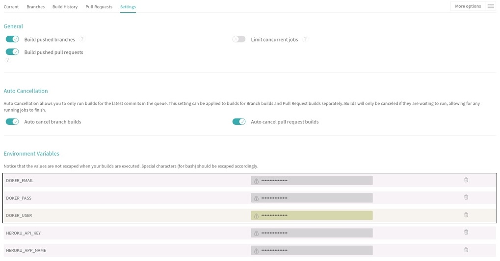

### Шаг № 3
**Как начать тестирование навыка в `Яндекс.Диалоги?`**
* Сначала создаем аккаунт на `Яндекс.Почте`. Если вы уже зарегистрированы там, то воспользуйтесь своей учетной записью.
* Затем перейдите по [ссылке](https://dialogs.yandex.ru). Заходим в свой аккаунт `Яндекс.Диалогов`, используя `Яндекс.Почту`.
* Выбираем `Создать диалог`
* Выбираем тип диалога:
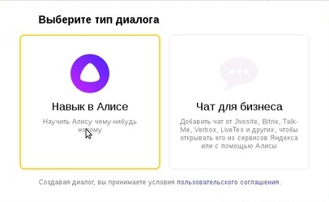
* В открывшейся страницы заполняем необходимые поля. Поле `Webhook URL` берем на `Heroku`(заходим в ваш контейнер,
 нажимаем `Open app` и копируем `url`):

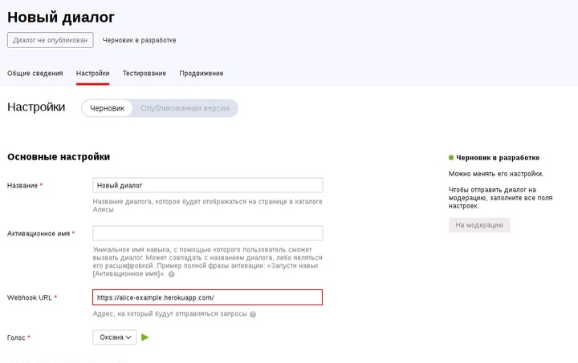
* После заполнения основных полей нажимаем `Сохранить`. Теперь можно приступать к тестированию!
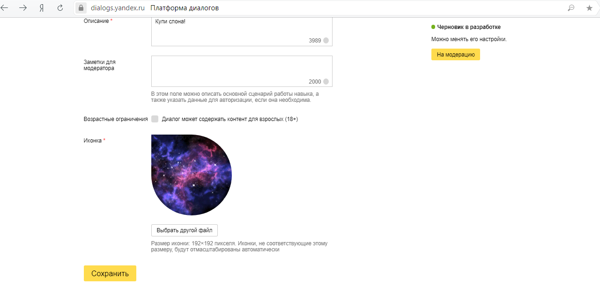

### Шаг № 4
**Как добавить картинку в навык?**
* Если ваш навык отвечает на определенный запрос пользователя картинкой (в нашем случае - картинкой слона), необходимо
добавить её в `Яндекс.Диалоги`. Это можно сделать, отправив url-запрос `Яндекс.Диалогам`. Мы используем для этих целей `Online Rest Client`.
Это также возможно сделать с помощью `curl` (подробнее об отправке запросов с Алисе с помощью `curl` можно прочитать в документации,
которая находится по ссылке в п.1)
1) Инструкция:
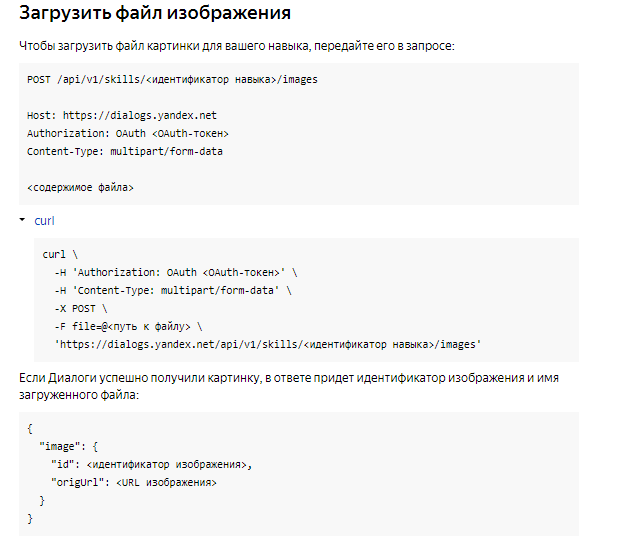
Более подробную информацию можно найти [тут](https://tech.yandex.ru/dialogs/alice/doc/resource-upload-docpage/#resource-upload__list).
2) OAuth токен получаем, перейдя по ссылке в п.1 и нажав ` OAuth-токен для Диалогов`.
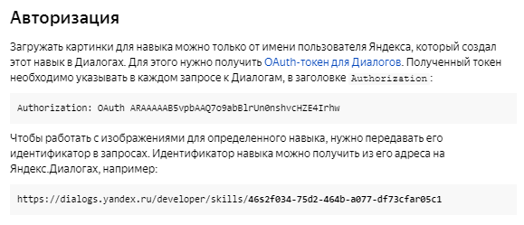
3) Идентификатор навыка получаем, открыв страницу вашего навыка:
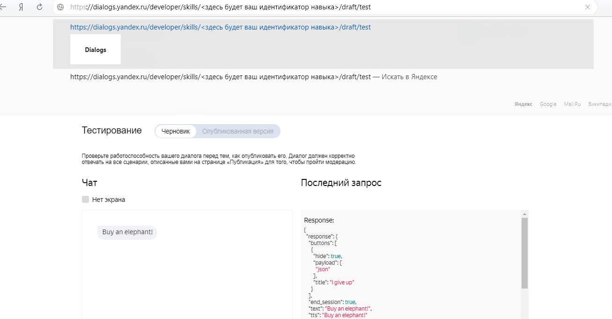
4) Для отправления запроса `Яндекс.Диалогам` воспользуемся [Online rest client](http://client.restcase.com)
5) Заполняем поля запроса:
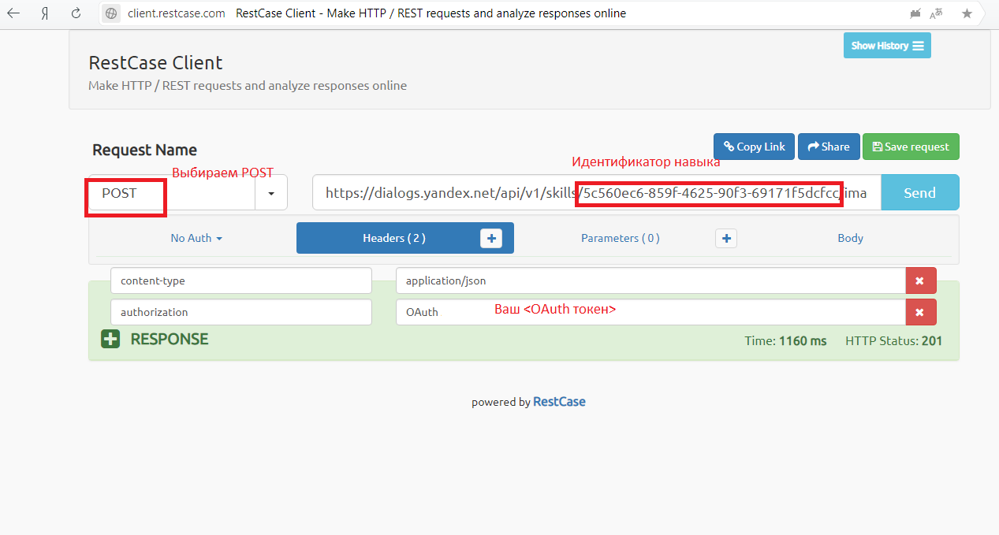
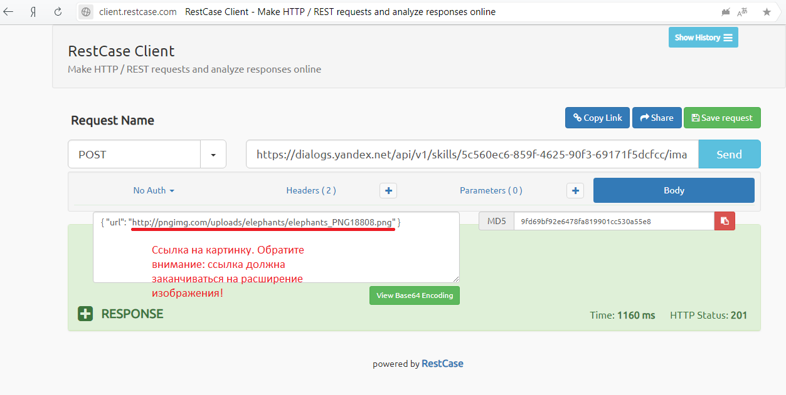
6) В ответ на ваш запрос `Яндекс.Диалоги` пришлет `Json`, содержащий `идентификатор изображения`:
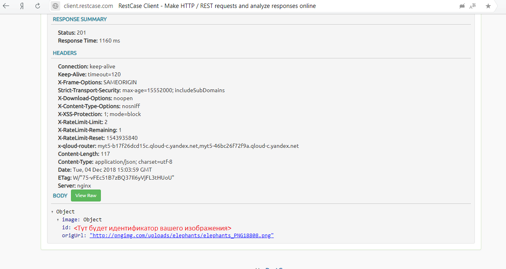
7) Идентификатор необходимо скопировать и добавить в соответствующее поле карточки `Card` вашей функции `buy_elephant_callback`
в `source/main.cpp`(выделенное поле на скриншоте)
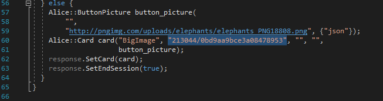

### Желаем удачи в создании навыков!!!